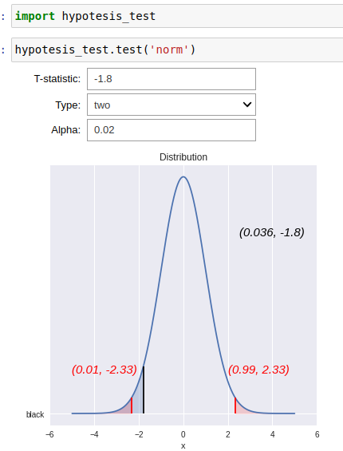

### Overview
This library is used for hypotesis testing. 

This code is meant to be for teaching purposes at IronHack. It is based on the original code from the lead teacher [Ignacio Soteras](https://github.com/isg75)

### Contents
The distributions supported are:
- T-student
- Normal

It contains:
- Left test
- Right test
- Two sided test


### How to use it
You have 2 options:

1) Clone the repo and run the file called `try_it.ipynp`


2) Download the file `hypotesis-test.py` and place it on a folder. Create a new notebook on the same folder and write on a cell the following:

```
>> import hypotesis-test
>> hypotesis-test.normal() # For normal dist
>> hypotesis-test.t-student() # For t-student dist
```

### Example

